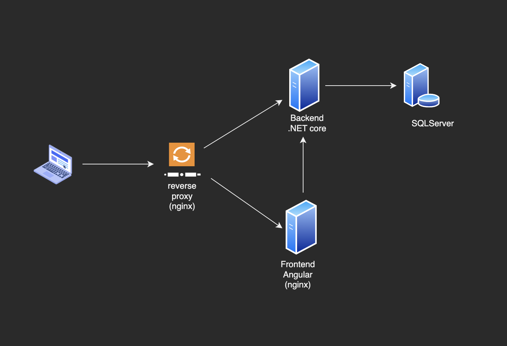

<!-- PROJECT LOGO -->
<br />
<div align="center">
  <a href="https://github.com/cristhianfms/pharmacies">
    
  </a>

  <p align="center">
    Full Stack project
  </p>
</div>


<!-- TABLE OF CONTENTS -->

<summary>Table of Contents</summary>
<ol>
  <li>
    <a href="#about-the-project">About The Project</a>
    <ul>
      <li><a href="#built-with">Built With</a></li>
    </ul>
  </li>
  <li>
    <a href="#getting-started">Getting Started</a>
    <ul>
      <li><a href="#prerequisites">Prerequisites</a></li>
      <li><a href="#installation">Installation</a></li>
    </ul>
  </li>
  <li><a href="#usage">Usage</a></li>
  <li><a href="#contributors">Contributors</a></li>
</ol>


<!-- ABOUT THE PROJECT -->
## About The Project

The system can be divided in two main parts: 

* A public website where anyone can purchase medicines from a variety of drug stores/chemists.

* The second part is a CMS (Content Managment System) where users with different roles; admin, employee, etc are able to manage drug stores/chemists, medicines and stocks, create reports, and others.

The following are the main features for each user role:

__Anonymous:__
* Search medicines by name or drug stores/chemists with stock available
* Purchase medicines and follow the purchase status


__Admin:__
* Create new invitations for any kind of user
* Edit registration role, name and allocated outlet
* Register new drug stores/chemists


__Employee:__
* Create and delete a medicine
* Request restocking of medicines
* Help in the stock taking process
* Follow users purchase history
* Approve or reject purchases
* Compatibility with JSON files
* Export medicine lists to a JSON file

__Owner:__
* Approve or reject requests for medicine restocking
* Generate purchases reports by date


### Built With

The following technologies has been used in the backend:

* [![Net][Net.com]][Net-url]
* [![SQLServer][SQLServer.com]][Net-url]

In the frontend:
* [![Angular][Angular.io]][Angular-url]
* [![Bootstrap][Bootstrap.com]][Bootstrap-url]

For building and deploying the whole environment:
* [![Docker][Docker.com]][Net-url]
* [![Nginx][Nginx.com]][Nginx-url]


<!-- GETTING STARTED -->
## Architecture




<!-- GETTING STARTED -->
## Getting Started

To get a local environment up and running follow these steps.


### Prerequisites

All the services, frontend, backend and data base are containerized with docker to make the bulding and deploying very simple. Make sure to have installed and running [docker](https://www.docker.com/) installed in your computer.


### Installation

1. Clone the repo
   ```sh
   git clone https://github.com/cristhianfms/pharmacies.git
   ```

2. Go to the root directory of the project
   ```sh
   cd pharmacies
   ```
3. Build docker images and run containers

   ```js
   docker-compose build
   docker-compose up
   ```

4. In the browser access http://localhost


<!-- USAGE EXAMPLES -->
## Usage

A user and password is created automatically:

`user: Admin`

`password: admin1234-`

<br />


<br />


_For a complete API documentation, please refer to the [API Documentation](Documentation/API_Documentation.pdf)_


<!-- Contributors -->
## Contributors 
[![LinkedIn][linkedin-shield-cris]][linkedin-url-cris] [![LinkedIn][linkedin-shield-fede]][linkedin-url-fede] [![LinkedIn][linkedin-shield-nacho]][linkedin-url-nacho]


<!-- MARKDOWN LINKS & IMAGES -->
[linkedin-shield-cris]: https://img.shields.io/badge/-Cristhian_Maciel-black.svg?style=for-the-badge&logo=linkedin&colorB=555
[linkedin-url-cris]: https://www.linkedin.com/in/cristhianfms/
[linkedin-shield-nacho]: https://img.shields.io/badge/-Ignacio_Olivera-black.svg?style=for-the-badge&logo=linkedin&colorB=555
[linkedin-url-nacho]: https://www.linkedin.com/in/nacho/
[linkedin-shield-fede]: https://img.shields.io/badge/-Federico_Czarnievicz-black.svg?style=for-the-badge&logo=linkedin&colorB=555
[linkedin-url-fede]: https://www.linkedin.com/in/federico-czarnievicz-907a28200/
[SQLServer.com]: https://img.shields.io/badge/SQLServer-CC2927?style=for-the-badge&logo=sqlserver&logoColor=white
[SQLServer-url]: https://www.microsoft.com/en-us/sql-server/
[NET.com]: https://img.shields.io/badge/.NET-512BD4?style=for-the-badge&logo=net&logoColor=white
[NET-url]: https://dotnet.microsoft.com/
[Angular.io]: https://img.shields.io/badge/Angular-DD0031?style=for-the-badge&logo=angular&logoColor=white
[Angular-url]: https://angular.io/
[Bootstrap.com]: https://img.shields.io/badge/Bootstrap-563D7C?style=for-the-badge&logo=bootstrap&logoColor=white
[Bootstrap-url]: https://getbootstrap.com
[Docker.com]: https://img.shields.io/badge/Docker-2496ED?style=for-the-badge&logo=sqlserver&logoColor=white
[Docker-url]: https://www.docker.com/
[Nginx.com]: https://img.shields.io/badge/Nginx-009639?style=for-the-badge&logo=sqlserver&logoColor=white
[Nginx-url]: https://www.nginx.com/